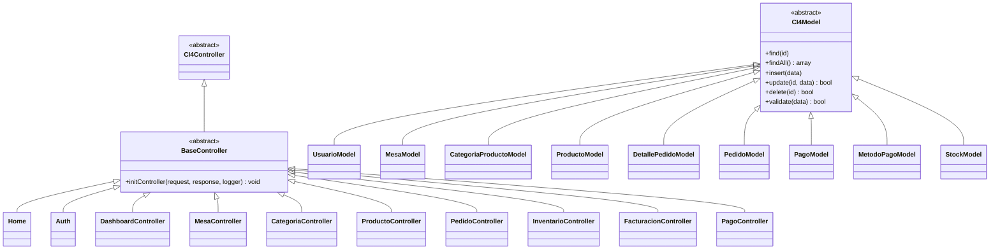
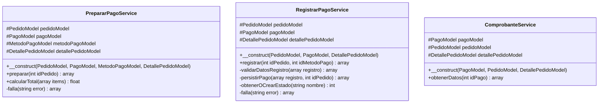

# Diagrama de Clases — BarPOS

## Introducción

Este documento describe el diagrama de clases del sistema BarPOS. A diferencia de un diagrama entidad-relación (que modela tablas y relaciones de base de datos), el diagrama de clases modela las **clases del software**: sus atributos, métodos, visibilidad y relaciones estructurales (herencia, composición, dependencia).

El sistema se organiza en tres capas de aplicación:

| Capa | Clases | Responsabilidad |
|---|---|---|
| **Controllers** | 11 clases | Reciben peticiones HTTP, coordinan y devuelven respuestas (views o redirects) |
| **Services** | 3 clases | Encapsulan lógica de negocio compleja; no conocen el protocolo HTTP |
| **Models** | 9 clases | Acceden a la base de datos; encapsulan consultas y validaciones |

Todas las clases del proyecto heredan de clases base del framework **CodeIgniter 4**.

---

## Diagrama 1 — Jerarquía de Herencia

---

## Diagrama 2 — Dependencias entre Capas

```mermaid
classDiagram
    direction TB

    %% ============================================================
    %% CAPA: CONTROLLERS
    %% ============================================================
    class Auth {
        <<Controller>>
        +login()
        +authenticate()
        +register()
        +store()
        +logout()
    }
    class DashboardController {
        <<Controller>>
        +index() string
    }
    class MesaController {
        <<Controller>>
        +mostrarResumen() string
        +cambiarEstado(idMesa)
        +crearMesa() string
        +validarYalmacenar()
        +eliminarMesa(idMesa)
    }
    class CategoriaController {
        <<Controller>>
        +index() string
        +create() string
        +store()
        +edit(idCategoria) string
        +update(idCategoria)
        +deactivate(idCategoria)
    }
    class ProductoController {
        <<Controller>>
        +index() string
        +create() string
        +store()
        +edit(idProducto) string
        +update(idProducto)
        +deactivate(idProducto)
    }
    class PedidoController {
        <<Controller>>
        +index() string
        +create() string
        +store()
        +show(idPedido) string
        +agregarDetalle(idPedido)
        +eliminarDetalle(idPedido, idDetalle)
        +cerrar(idPedido)
        +reabrir(idPedido)
        +historial() string
    }
    class InventarioController {
        <<Controller>>
        +index() string
        +create() string
        +store()
        +edit(idStock) string
        +update(idStock)
        +alertas() string
    }
    class FacturacionController {
        <<Controller>>
        +index() string
        +detalle(idPago) string
    }
    class PagoController {
        <<Controller>>
        +mostrarFormularioDePago(idPedido)
        +procesarRegistroDePago(idPedido)
        +mostrarComprobanteDePago(idPago)
    }

    %% ============================================================
    %% CAPA: SERVICES
    %% ============================================================
    class PrepararPagoService {
        <<Service>>
        +preparar(idPedido) array
        +calcularTotal(items) float
    }
    class RegistrarPagoService {
        <<Service>>
        +registrar(idPedido, idMetodoPago) array
    }
    class ComprobanteService {
        <<Service>>
        +obtenerDatos(idPago) array
    }

    %% ============================================================
    %% CAPA: MODELS
    %% ============================================================
    class UsuarioModel {
        <<Model>>
    }
    class MesaModel {
        <<Model>>
    }
    class CategoriaProductoModel {
        <<Model>>
    }
    class ProductoModel {
        <<Model>>
    }
    class DetallePedidoModel {
        <<Model>>
    }
    class PedidoModel {
        <<Model>>
    }
    class PagoModel {
        <<Model>>
    }
    class MetodoPagoModel {
        <<Model>>
    }
    class StockModel {
        <<Model>>
    }

    %% Controllers → Models (composición: el controller posee instancias de los modelos)
    Auth *-- UsuarioModel
    MesaController *-- MesaModel
    MesaController *-- PedidoModel
    CategoriaController *-- CategoriaProductoModel
    ProductoController *-- ProductoModel
    ProductoController *-- CategoriaProductoModel
    PedidoController *-- PedidoModel
    PedidoController *-- MesaModel
    PedidoController *-- ProductoModel
    PedidoController *-- DetallePedidoModel
    InventarioController *-- StockModel
    InventarioController *-- ProductoModel
    FacturacionController *-- PagoModel
    FacturacionController *-- PedidoModel
    FacturacionController *-- DetallePedidoModel

    %% PagoController → Services (dependencia: delega via service helper)
    PagoController ..> PrepararPagoService : delega
    PagoController ..> RegistrarPagoService : delega
    PagoController ..> ComprobanteService : delega

    %% Services → Models (composición: el service posee instancias de los modelos)
    PrepararPagoService *-- PedidoModel
    PrepararPagoService *-- PagoModel
    PrepararPagoService *-- MetodoPagoModel
    PrepararPagoService *-- DetallePedidoModel
    RegistrarPagoService *-- PedidoModel
    RegistrarPagoService *-- PagoModel
    RegistrarPagoService *-- DetallePedidoModel
    ComprobanteService *-- PagoModel
    ComprobanteService *-- PedidoModel
    ComprobanteService *-- DetallePedidoModel
```

---

## Diagrama 3 — Clases Completas (atributos y métodos)

### 3.1 Controladores

```mermaid
classDiagram
    direction TB

    class BaseController {
        <<abstract>>
        +initController(RequestInterface, ResponseInterface, LoggerInterface) void
    }

    class Home {
        +index() string
    }

    class Auth {
        #UsuarioModel usuarioModel
        #array helpers
        +login()
        +authenticate()
        +register()
        +store()
        +logout()
    }

    class DashboardController {
        +index() string
    }

    class MesaController {
        #MesaModel mesaModel
        #PedidoModel pedidoModel
        +mostrarResumen() string
        +cambiarEstado(int idMesa) RedirectResponse
        +crearMesa() string
        +validarYalmacenar() RedirectResponse
        +eliminarMesa(int idMesa) RedirectResponse
    }

    class CategoriaController {
        #CategoriaProductoModel categoriaModel
        +index() string
        +create() string
        +store() RedirectResponse
        +edit(int idCategoria) string
        +update(int idCategoria) RedirectResponse
        +deactivate(int idCategoria) RedirectResponse
    }

    class ProductoController {
        #ProductoModel productoModel
        #CategoriaProductoModel categoriaModel
        +index() string
        +create() string
        +store() RedirectResponse
        +edit(int idProducto) string
        +update(int idProducto) RedirectResponse
        +deactivate(int idProducto) RedirectResponse
    }

    class PedidoController {
        #PedidoModel pedidoModel
        #MesaModel mesaModel
        #ProductoModel productoModel
        #DetallePedidoModel detallePedidoModel
        +index() string
        +create() string
        +store() RedirectResponse
        +show(int idPedido) string
        +agregarDetalle(int idPedido) RedirectResponse
        +eliminarDetalle(int idPedido, int idDetalle) RedirectResponse
        +cerrar(int idPedido) RedirectResponse
        +reabrir(int idPedido) RedirectResponse
        +historial() string
        -getEstadoId(string nombre) int
    }

    class InventarioController {
        #StockModel stockModel
        #ProductoModel productoModel
        +index() string
        +create() string
        +store() RedirectResponse
        +edit(int idStock) string
        +update(int idStock) RedirectResponse
        +alertas() string
    }

    class FacturacionController {
        #PagoModel pagoModel
        #PedidoModel pedidoModel
        #DetallePedidoModel detallePedidoModel
        +index() string
        +detalle(int idPago) string
    }

    class PagoController {
        +mostrarFormularioDePago(int idPedido)
        +procesarRegistroDePago(int idPedido)
        +mostrarComprobanteDePago(int idPago)
    }

    BaseController <|-- Home
    BaseController <|-- Auth
    BaseController <|-- DashboardController
    BaseController <|-- MesaController
    BaseController <|-- CategoriaController
    BaseController <|-- ProductoController
    BaseController <|-- PedidoController
    BaseController <|-- InventarioController
    BaseController <|-- FacturacionController
    BaseController <|-- PagoController
```

### 3.2 Servicios

### 3.3 Modelos

```mermaid
classDiagram
    direction TB

    class UsuarioModel {
        #string table = "usuarios"
        #string primaryKey = "id_usuario"
        #array customErrors
        +validarLogin(string login, string password) array
        +getUsuarioPorLogin(string login) array
        +registrarUsuario(array datos) int
        +emailExiste(string email) bool
        +usernameExiste(string username) bool
        +dniExiste(int dni) bool
        +emailExisteExcluir(string email, int excludeId) bool
        +getUsuarioConRol(int id) array
        +getUsuariosActivos() array
        +getUsuariosPorRol(int idRol) array
        +actualizarPassword(int id, string actual, string nueva) bool
        +setActivo(int id, bool activo) bool
        +getErrores() array
        +getPrimerError() string
    }

    class MesaModel {
        #string table = "mesas"
        #string primaryKey = "id_mesa"
        #array allowedFields
        +getMesasConPedidoActivo() array
        +contarPorEstado() array
    }

    class CategoriaProductoModel {
        #string table = "categorias_productos"
        #string primaryKey = "id_categoria"
        #array allowedFields
        +getAll() array
        +getCategoriasActivas() array
    }

    class ProductoModel {
        #string table = "productos"
        #string primaryKey = "id_producto"
        #array allowedFields
        +getTodos() array
        +getProductosActivos() array
        +getProductosPorCategoria(int idCategoria, bool soloVentaBarra) array
        +getProductosConControlStock() array
        +getProductoConCategoria(int idProducto) array
    }

    class DetallePedidoModel {
        #string table = "detalle_pedidos"
        #string primaryKey = "id_detalle_pedido"
        #array allowedFields
        +getDetallesPorPedido(int idPedido) array
        +getTotalPedido(int idPedido) float
    }

    class PedidoModel {
        #string table = "pedidos"
        #string primaryKey = "id_pedido"
        #array allowedFields
        +getPedidoActivoPorMesa(int idMesa) array
        +getPedidosActivos() array
        +getPedidosCerradosPorFecha(string fecha) array
        +getPedidosCerradosSinPago() array
        +getPedidoConDetalles(int idPedido) array
        +cerrarPedido(int idPedido) bool
        +contarPedidosPorTipo() array
    }

    class PagoModel {
        #string table = "pagos"
        #string primaryKey = "id_pago"
        #array allowedFields
        +getPagoPorPedido(int idPedido) array
        +getPagoConMetodo(int idPago) array
        +getTotalPagadoPorFecha(string fecha) float
    }

    class MetodoPagoModel {
        #string table = "metodos_pago"
        #string primaryKey = "id_metodo_pago"
        #array allowedFields
        +getActivos() array
    }

    class StockModel {
        #string table = "stock"
        #string primaryKey = "id_stock"
        #array allowedFields
        +getStockConProductos() array
        +getStockBajo() array
        +getStockPorProducto(int idProducto) array
        +actualizarCantidad(int idProducto, int diferencia) bool
        +haySuficienteStock(int idProducto, int cantidad) bool
    }
```

---

## Catálogo de Clases

### Controladores

| Clase | Hereda de | Modelos que posee | Descripción |
|---|---|---|---|
| `BaseController` | `CI4\Controller` | — | Clase base abstracta; inicializa helpers, request, response y logger |
| `Home` | `BaseController` | — | Redirige `/` al login |
| `Auth` | `BaseController` | `UsuarioModel` | Login, registro y logout de usuarios |
| `DashboardController` | `BaseController` | — | Panel principal con KPIs y resumen de mesas |
| `MesaController` | `BaseController` | `MesaModel`, `PedidoModel` | CRUD de mesas y cambio de estado |
| `CategoriaController` | `BaseController` | `CategoriaProductoModel` | CRUD de categorías con desactivación lógica |
| `ProductoController` | `BaseController` | `ProductoModel`, `CategoriaProductoModel` | CRUD de productos con desactivación lógica |
| `PedidoController` | `BaseController` | `PedidoModel`, `MesaModel`, `ProductoModel`, `DetallePedidoModel` | Ciclo de vida completo del pedido |
| `InventarioController` | `BaseController` | `StockModel`, `ProductoModel` | CRUD de stock y alertas de stock bajo |
| `FacturacionController` | `BaseController` | `PagoModel`, `PedidoModel`, `DetallePedidoModel` | Listado de pagos del día y detalle de factura |
| `PagoController` | `BaseController` | — | Adaptador HTTP del módulo de pago; delega en Services |

### Servicios

| Clase | Modelos que posee | Descripción |
|---|---|---|
| `PrepararPagoService` | `PedidoModel`, `PagoModel`, `MetodoPagoModel`, `DetallePedidoModel` | Valida el pedido, detecta pago duplicado y prepara datos para el formulario de cobro |
| `RegistrarPagoService` | `PedidoModel`, `PagoModel`, `DetallePedidoModel` | Calcula el total server-side, valida y persiste el pago en transacción |
| `ComprobanteService` | `PagoModel`, `PedidoModel`, `DetallePedidoModel` | Recupera todos los datos necesarios para renderizar el comprobante de pago |

### Modelos

| Clase | Tabla | Clave primaria | Características clave |
|---|---|---|---|
| `UsuarioModel` | `usuarios` | `id_usuario` | Login dual (email o username); soft-delete via `activo`; manejo de errores con `$customErrors` |
| `MesaModel` | `mesas` | `id_mesa` | Estados: `libre`, `ocupada`, `reservada`, `inactiva` |
| `CategoriaProductoModel` | `categorias_productos` | `id_categoria` | Soft-delete via campo `activa` |
| `ProductoModel` | `productos` | `id_producto` | Flag `se_vende_en_barra`; soft-delete via `activo`; flag `controla_stock` |
| `DetallePedidoModel` | `detalle_pedidos` | `id_detalle_pedido` | Líneas de un pedido; calcula `subtotal` total del pedido |
| `PedidoModel` | `pedidos` | `id_pedido` | `fecha_cierre = NULL` indica pedido abierto; tipo: `mesa`, `barra`, `take_away` |
| `PagoModel` | `pagos` | `id_pago` | Relación 1:1 con pedido cerrado; almacena monto y fecha de pago |
| `MetodoPagoModel` | `metodos_pago` | `id_metodo_pago` | Catálogo de métodos de pago (efectivo, tarjeta, etc.) |
| `StockModel` | `stock` | `id_stock` | Relación 1:1 con `productos`; alerta cuando `cantidad_disponible < cantidad_minima` |

---

## Tipos de Relaciones Utilizadas

| Símbolo Mermaid | Tipo | Significado en este sistema |
|---|---|---|
| `<\|--` | Herencia (generalización) | Una clase extiende a otra (`extends`) |
| `*--` | Composición | El controlador/servicio **instancia y posee** el modelo en su constructor |
| `..>` | Dependencia | `PagoController` resuelve servicios en tiempo de ejecución vía `service()` helper |

---

## Notas sobre el Diseño

1. **Separación de responsabilidades:** El módulo de pago aplica el patrón Service Layer. `PagoController` no contiene lógica de negocio: delega completamente en `PrepararPagoService`, `RegistrarPagoService` y `ComprobanteService`.

2. **Composición sobre herencia en models:** Los modelos no tienen jerarquías propias entre sí. Todos heredan directamente de `CI4Model` y se especializan mediante métodos de consulta personalizados.

3. **Soft-delete manual:** `ProductoModel` y `CategoriaProductoModel` no usan el mecanismo de soft-delete de CI4; el campo `activo`/`activa` se gestiona con `deactivate()` en el controlador.

4. **Controllers sin Services:** Todos los controladores excepto `PagoController` acceden a los modelos directamente. La capa de servicios existe solo donde la lógica de negocio es lo suficientemente compleja para justificarlo (transacciones, validaciones cruzadas).
