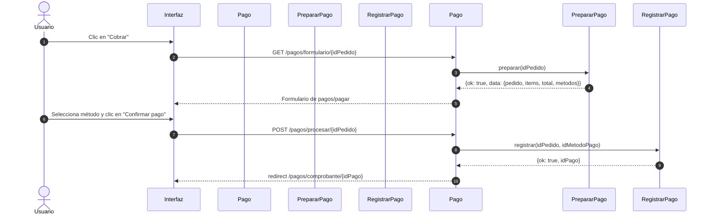

# Flujo de pagos — BarPOS

## Arquitectura del módulo

El módulo de pagos se divide en tres capas:

- **Controladores (adaptadores HTTP):** leen la entrada HTTP, delegan en el servicio correspondiente y convierten el resultado en `redirect` o `view`. No contienen lógica de negocio.
- **Servicios de aplicación (`app/Services/`):** contienen toda la lógica de negocio. Reciben datos simples, no objetos HTTP, y devuelven arrays de resultado.
- **Modelos:** encapsulan las consultas SQL. Los servicios los usan directamente; los controladores no.

---

# Fase 1 — Mostrar el formulario de pago

## 1. Formas de llegar al formulario

    1.0. Desde /pedidos/detalles/{id_pedido}: clic en "Registrar pago"
         → GET /pagos/formulario/{id_pedido}
         → PrepararPagoController::mostrarFormularioDePago(id_pedido)

    1.1. Desde /pedidos: clic en "Cobrar" en la tabla de pedidos pendientes de pago
         → GET /pagos/formulario/{id_pedido}
         → PrepararPagoController::mostrarFormularioDePago(id_pedido)

## 2. Acciones de PrepararPagoController::mostrarFormularioDePago(id_pedido)

    2.0. Invoca service('prepararPago')->preparar(id_pedido)
         (servicio: App\Services\PrepararPagoService)

    2.1. Evalúa el resultado:
         — Si resultado['pagoExistenteId'] != null → redirect a /pagos/comprobante/{id}
         — Si resultado['ok'] = false              → redirect a /pedidos con error
         — Si resultado['ok'] = true               → renderiza pagos/pagar con los datos

## 3. Acciones de PrepararPagoService::preparar(id_pedido)

    3.0. Llama a PedidoModel::getPedidoConDetalles(id_pedido)
         — Si es null              → falla: 'El pedido no existe.'
         — Si fecha_cierre es null → falla: 'El pedido debe cerrarse antes de registrar el pago.'

    3.1. Llama a PagoModel::getPagoPorPedido(id_pedido)
         — Si ya existe un pago → devuelve {ok: false, pagoExistenteId: id_pago}

    3.2. Llama a DetallePedidoModel::getDetallesPorPedido(id_pedido) y guarda los ítems

    3.3. Calcula el total con array_sum(array_column($items, 'subtotal'))

    3.4. Llama a MetodoPagoModel::getActivos() para obtener los métodos de pago disponibles

    3.5. Devuelve {ok: true, data: {pedido, items, total, metodos}}

---

# Fase 2 — Registrar el pago

## 1. El usuario selecciona el método de pago

    1.0. La interfaz marca visualmente el método de pago seleccionado
    1.1. El usuario hace clic en "Confirmar pago"

## 2. Acciones de PagoController::procesarRegistroDePago(id_pedido)

    2.0. Lee id_metodo_pago del POST: $this->request->getPost('id_metodo_pago')

    2.1. Invoca service('registrarPago')->registrar(id_pedido, id_metodo_pago)
         (servicio: App\Services\RegistrarPagoService)

    2.2. Evalúa el resultado:
         — Si resultado['pagoExistenteId'] != null  → redirect a /pagos/comprobante/{id}
         — Si resultado['ok'] = false y hay errors  → redirect back con errores de validación
         — Si resultado['ok'] = false y hay error   → redirect a /pedidos con mensaje de error
         — Si resultado['ok'] = true                → redirect a /pagos/comprobante/{id_pago}

## 3. Acciones de RegistrarPagoService::registrar(id_pedido, id_metodo_pago)

    3.0. Llama a PedidoModel::find(id_pedido)
         — Si es null o fecha_cierre está vacía → falla: 'El pedido no es válido para registrar pago.'

    3.1. Llama a PagoModel::getPagoPorPedido(id_pedido)
         — Si ya existe un pago → devuelve {ok: false, pagoExistenteId: id_pago}

    3.2. Llama a DetallePedidoModel::getDetallesPorPedido(id_pedido)
         Calcula el total = Σ(subtotales) de cada línea de detalle
         El monto viene de la base de datos, no del formulario HTML

    3.3. Construye el array $registro = {id_pedido, id_metodo_pago, monto, fecha_pago}
         Llama a PagoModel::validate($registro)
         — Si falla la validación → devuelve {ok: false, errors: [...]}

    3.4. Obtiene el id del estado 'pagado' (lo crea en estados_pedido si no existe)
         [fuera de la transacción para evitar conflictos de conexión anidada]

    3.5. Inicia transacción $db->transStart()
         — PagoModel::insert($registro)          → inserta el pago
         — PedidoModel::update(id_pedido, ...)   → actualiza estado a 'pagado'
         $db->transComplete()
         — Si transStatus() = false → falla: 'Error al registrar el pago.'

    3.6. Devuelve {ok: true, idPago: id_pago}

---

# Fase 3 — Mostrar el comprobante

## 1. Acciones de PagoController::mostrarComprobanteDePago(id_pago)

    1.0. Invoca service('comprobante')->obtenerDatos(id_pago)
         (servicio: App\Services\ComprobanteService)

    1.1. Si resultado['ok'] = false → redirect a /pedidos con error
    1.2. Si resultado['ok'] = true  → renderiza pagos/recibo con los datos

## 2. Acciones de ComprobanteService::obtenerDatos(id_pago)

    2.0. Llama a PagoModel::getPagoConMetodo(id_pago)
         — Si es null → devuelve {ok: false}

    2.1. Llama a DetallePedidoModel::getDetallesPorPedido(id_pedido)
         (JOIN con productos para obtener el nombre de cada ítem)

    2.2. Llama a PedidoModel::getPedidoConDetalles(id_pedido)

    2.3. Calcula el total = Σ(subtotales)

    2.4. Devuelve {ok: true, pago, pedido, items, total}

---

# Registro de servicios

Los tres servicios se registran en `app/Config/Services.php` y se accede a ellos
mediante `service('prepararPago')`, `service('registrarPago')` y `service('comprobante')`.
Esto centraliza la instanciación, elimina `new` dispersos en controladores y
facilita la sustitución de dependencias en tests.

---

# Cobertura de tests

    tests/unit/PrepararPagoServiceTest.php
    — Pedido inexistente
    — Pedido abierto
    — Pago duplicado ya registrado
    — Cálculo de total (suma de subtotales)
    — Cálculo de total con ítems vacíos
    — Camino normal: devuelve pedido, ítems, total y métodos

    tests/unit/RegistrarPagoServiceTest.php
    — Pedido inexistente
    — Pedido abierto
    — Pago duplicado
    — Errores de validación del modelo
    — Total calculado desde detalles (no del formulario HTML)
    [La persistencia en transacción requiere tests de integración con BD real]

---

# Diagrama de secuencia — curso normal (click "Cobrar" → registro en BD)

